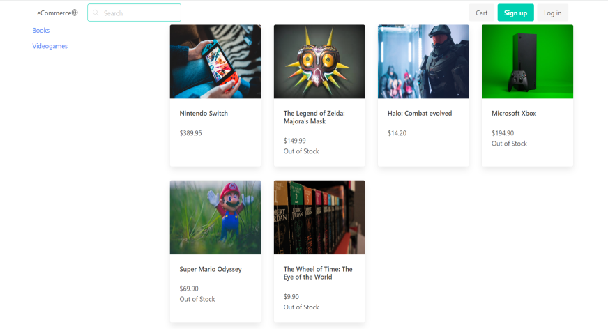
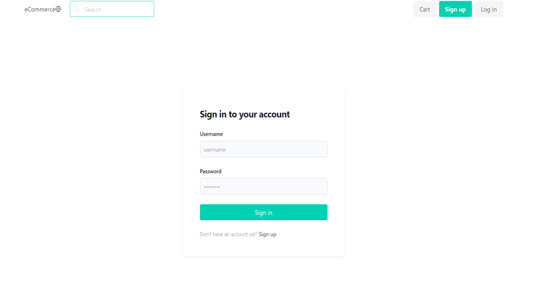
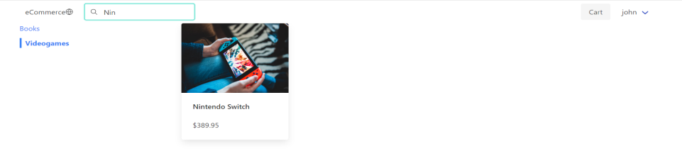
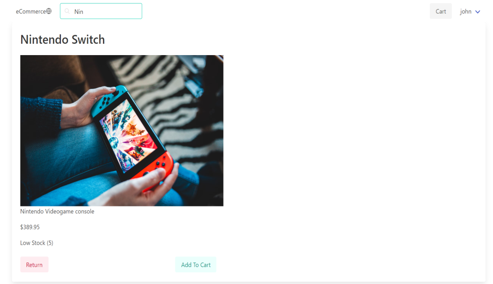
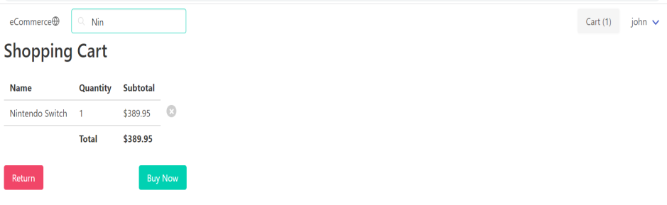
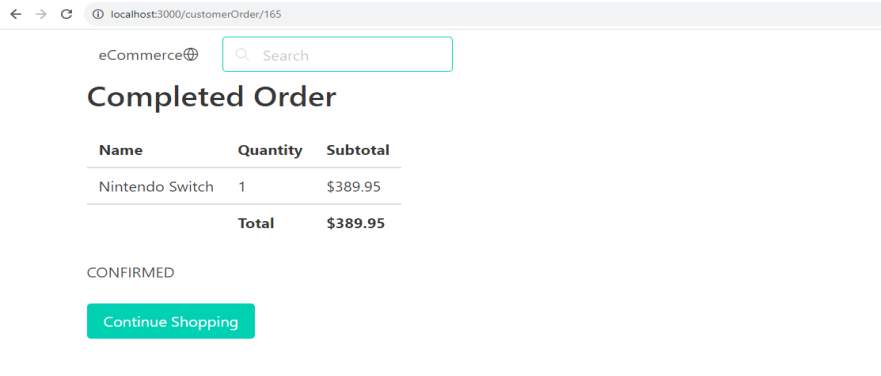
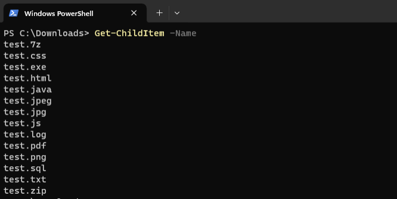
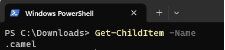
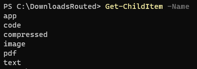
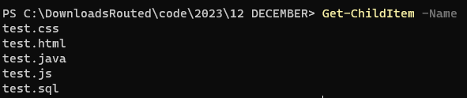

# Software Engineer
Java, Spring boot, Hibernate, React, AWS, Pega

## Education
### Monash University
Bachelor Of Science (Computer Science)  
WAM: 81.176 and GPA: 3.636

### Certifications
[Pega Certified Senior System Architect](https://academy.pega.com/verify-certification?fname=Mark&lname=Paterson)

## Work Experience
### Mar 2022 - July 2022 Application Developer
Red Energy
- Design, develop and unit test end to end software integration application using Groovy, Spring boot and Apache Camel
- Created routes to handle Google Drive file operations in the Camel application, using the Google Drive Component
- Automated a billing email process that would save Operations 2 to 3 days of manual labor a month

### Jan 2017 - Feb 2022 Software Engineer 
Verra Mobility
- Develop, debug and troubleshoot both Java Spring boot and Pega web applications 
- Contributed to over 350 knowledge based articles increasing productivity of the team overall
- Trusted to own the most critical issues and resolve within the business SLA
- SME for NSW and Canada clients that routinely provided advice and assistance to fellow engineers

## Projects
### eCommerce website

As a web developer, I wanted to create a project that can showcase the core skills. That is to create a web application. I chose to create an eCommerce website, where the customer can do the following
- List products based on the product category
- Filter products using a Search bar
- Add products to a shopping cart
- View the cart
- Place an order
- Login to the store

#### Front end User Interface
[View the code](https://github.com/markwp02/ecommerce)  
The front end code is developed using the React library, with Redux toolkit for state management. Styling is done with a combination of Bulma and Tailwind css frameworks.  
The front end application communicates with the backend by making REST API calls.  
Main page when you run the application.

  

Login screen. For an existing customers. This is intended to be able to view past orders. For new customers, you can click on the sign up button that takes you a similar form to create a new account.
  

Filtering by category and Search term. Clicking on Videogames category will display only the videogame products and entering in a search term into the search bar will filter the results based on the term entered.
  

Show full product details to add the product to the cart. Low stock dispays when stock is less than 10.
  

Shopping Cart gives you the option to change the quantity, or remove a product from the cart.
  

Currently, placing an order, will only save the order to the database and reduce the product stock. Then when finished will redirect to the completed order.

  

#### Back end web service
[View the code](https://github.com/markwp02/eCommerceService)  
The back end web service is responsible for 
- Handling the REST API calls coming from the user interface
- Interacting with the database

The technologies I have used for this task are Java with Spring boot and Hibernate. Then for the database, I have used H2, as it is sufficient for a development environment. 

When undertaking this project, from I wanted to find out and practice how to do the following
- Connect a javascript and java application together with REST API calls
- Encrypt a strong password that is safe to store in the database    

CORS cross origin resource sharing is needed to be added either as an annotation in your Rest Controller, or as a global configuration. Otherwise, you will get a permissions error. I went with the global configuration, as you only need to set it once and you can set the allowed API address in config.

To encrypt the password coming from te user interface, I used the BCryptPasswordEncoder from Spring Security. Bcrypt uses a random salt before hashing it. Using bcrypt again, will use a different random salt and a different result. To compare a passord, bcrypt uses the salt stored with the encrypted password, to compare the encrypted and unencrypted passwords. This makes it secure, as you are not able to just be able to decrypt the encrypted password.

### Downloads Cleanup
[View the code](https://github.com/markwp02/DownloadsCleanup)
     
If your like me, you routinely download files from the web, without either deleting or filing away the files. Over time, this can leave your downloads folder with many files and difficult to find the ones you want.

The Downloads Cleanup project is aimed at solving this problem by routing files by there entension. This project is a great oportunity to showcase the power of Apache Camel with its' Java Domain Specific Language (DSL), that routes from one File endpoint.   
The following file suffixes are configured:

- Pdf files .pdf &rarr; /pdf
- text files .txt, .log  &rarr;  /text
- code files .java, .sql, .html, .js, .css &rarr; /code
- image files .jpg, .png, .jpeg &rarr; /image
- compressed files .zip, .7z &rarr; /compressed
- executable files .exe &rarr; /app  

These file extensions, as well as the name of the directory to route to can be configured within the application.properties file.

After running the application

The files have all been routed to the destination directory

  

Where the files are archived based on the current date
  

